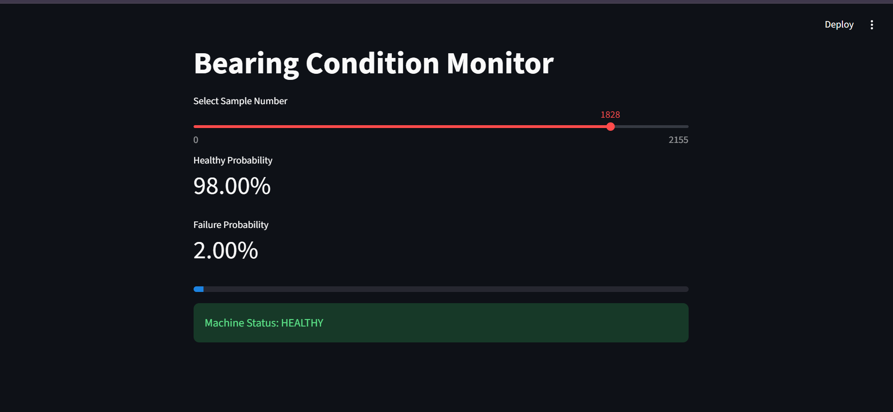
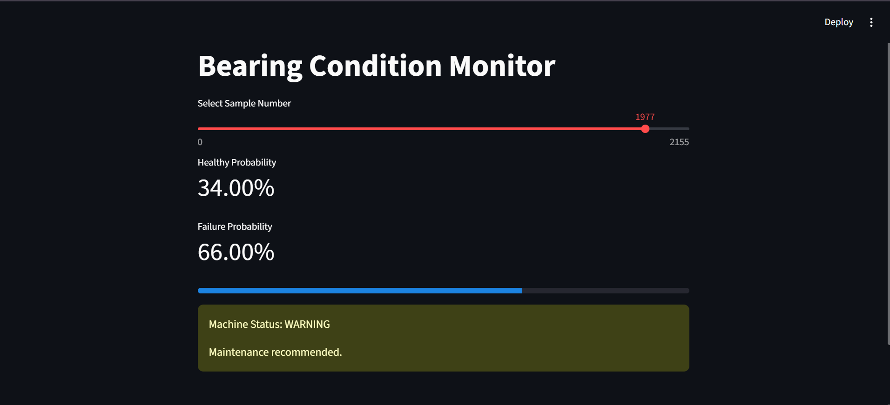
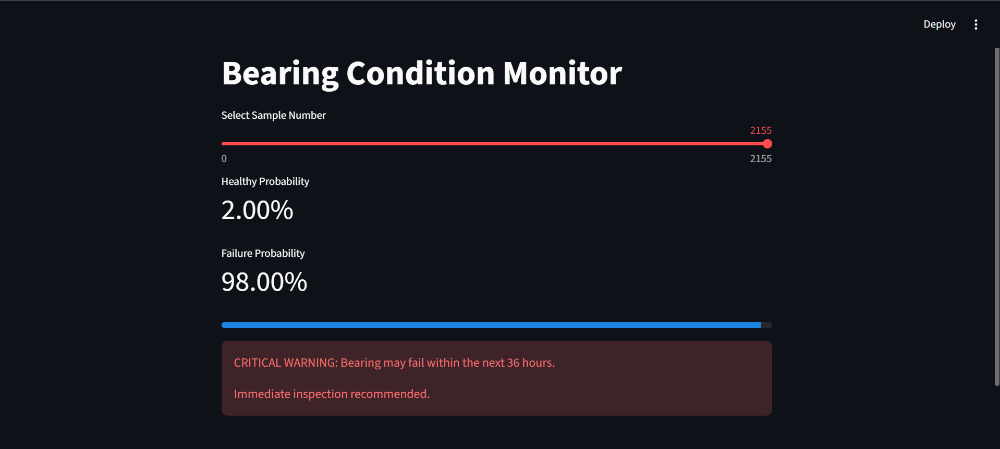

# Bearing_failure_prediction

A vibration based bearing failure prediction and condition monitoring system using machine learning.

## Overview

This project uses vibration data from the NASA IMS Bearing Dataset to predict bearing failures before they occur. Statistical features are extracted from vibration signals and used to train a machine learning model for predictive maintenance.
The system predicts potential bearing failures up to 36 hours in advance and provides an interactive dashboard for monitoring machine health.

## Features Extracted

- RMS
- Peak Value
- Standard Deviation (STD)
- Kurtosis
- Skewness

## Machine Learning Model

- Random Forest Classifier

## Prediction Output

The system classifies machine condition into:

- Healthy
- Warning
- Critical Warning

## Technologies Used

- Python
- Pandas
- NumPy
- Scikit-learn
- Matplotlib
- Streamlit
- Joblib

## Dataset

**NASA IMS Bearing Dataset**
The dataset is not included in this repository due to its large size.
Dataset Source: [NASA IMS Bearing Dataset](https://data.nasa.gov/dataset/ims-bearings)

## Project Structure

The dataset contains three separate bearing run-to-failure experiments (`test1`, `test2`, `test3`), each with its own vibration data and failure pattern. Each test folder contains the scripts required for feature extraction, model training, and failure prediction.

```text
test1/
├── features_t1.py
├── train_model_t1.py
├── app_t1.py

test2/
├── features_t2.py
├── train_model_t2.py
├── app_t2.py

test3/
├── features_t3.py
├── train_model_t3.py
├── app_t3.py
```

## Installation

```bash
pip install -r requirements.txt
```

## How to Run

### Step 1: Extract Features

```bash
python features_t1.py
```

### Step 2: Train the Model

```bash
python train_model_t1.py
```

### Step 3: Launch the Dashboard

```bash
python -m streamlit run app_t1.py
```

Replace `t1` with `t2` or `t3` to run the pipeline for the other test datasets.

## Sample Output

The dashboard displays:

- Healthy Probability
- Failure Probability
- Machine Status
- Maintenance Recommendation

## Demo

### Healthy



### Warning



### Critical Warning



## Author

Dharshini Muruganandham
